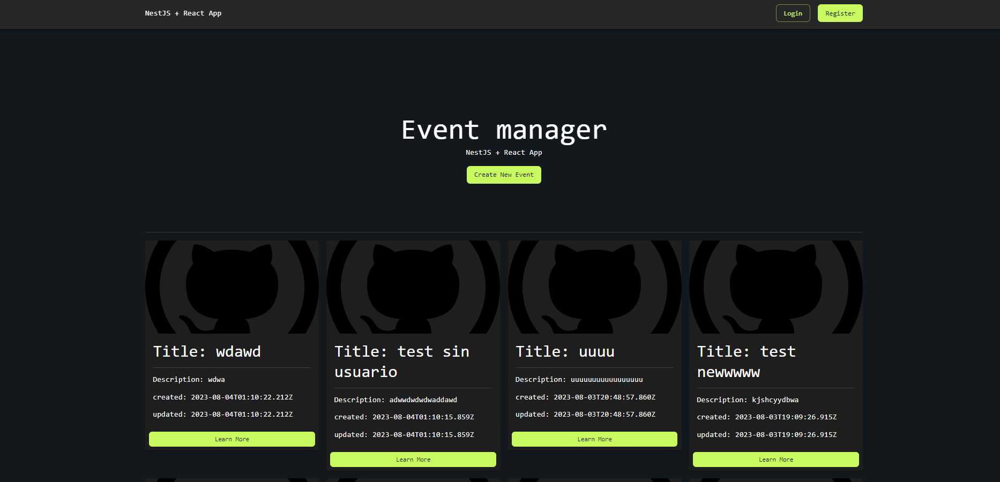
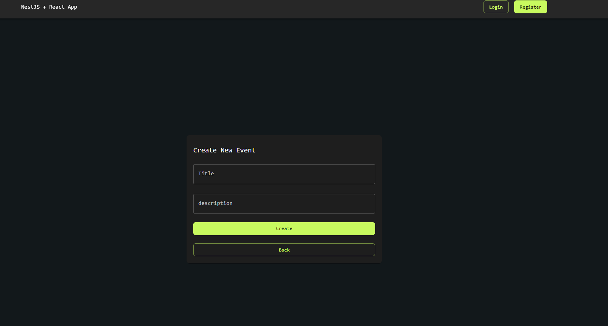
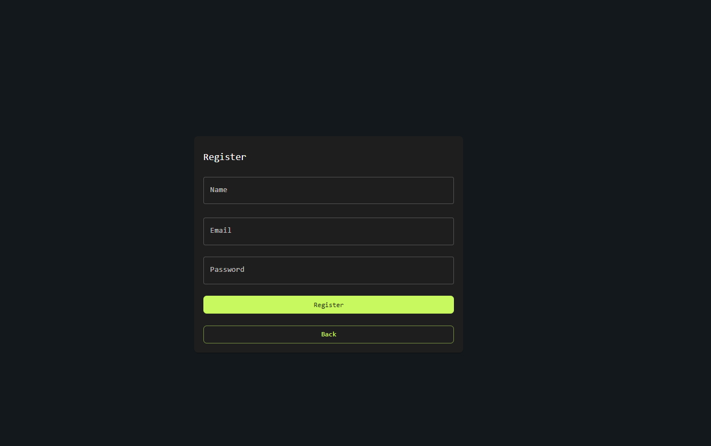
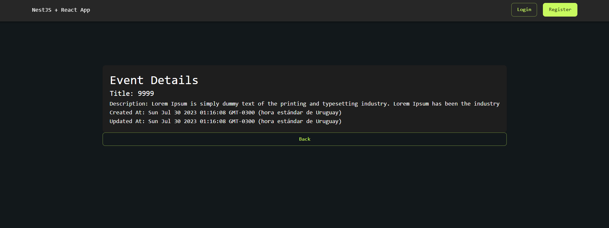

# Event manager
This is a frontend developed with reactjs for event handling, it consists of three modules (Users, Events and Auth) which allow CRUD operations regarding users and events, in addition to allowing a search by mail to login and keep a event log by uruarios

## Available Scripts

⚙️ Base dependencies:

- [ReactJS](https://reactjs.org/)
- [Axios](https://www.npmjs.com/package/axios) 
## Requirements

- [Node](https://nodejs.org/)
- [Npm](https://www.npmjs.com/) (preferably) or [yarn](https://yarnpkg.com/)
- [ReactJS]()

## 🚀 Lift service

### Local environment

You must have the requirements previously installed

In the terminal run the command `npm install` or` yarn` to install the necessary packages, then run the command `npm start` or` yarn start`.

The service will be lifted in http://localhost:3000

## Screens

### `Home`

### `New Event`

### `Register User`

### `Event details`

